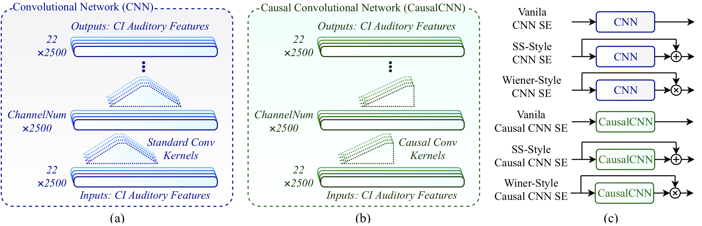

# DNN-based-speech-enhancement

## What is it?

This repository contains a python implementation of a deep neural network (DNN)-based speech enhancement system. It uses Keras with tensorflow back-end to train and test neural networks. The details of the implemented speech enhancement system are explained in the paper [1]. The system supports for the following features:

   (1) Standard and dilated convolutional networks.

   (2) Causal and non-causal convolutional networks.

   (3) Thre different styles of enhancement: vanila, spectral subtraction and Wiener

## How to run it? 

Contains all codes related to the paper:

[1] Nursadul M., Khorram S., Hansen J., "Convolutional Neural Network-based Speech Enhancement for Cochlear Implant Recipients", Interspeech, 2019.

